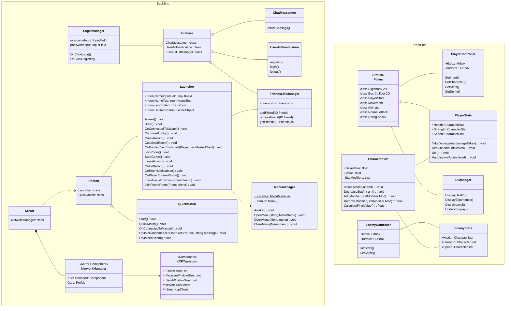

### Unity (Game Engine)
Unity will be the hub for all of the user data. 
#### Interfaces (Data Sent)
* **Firebase Real-time Database**
    * Lobby Messages
    * New Friends' IDs
    * Credentials (Authentication)
* **Photon (Multiplayer Matchmaking)**
    * Networked lobby system

### Firebase (Real-time Database & User Authentication)
Firebase will be used to create a customizable user authentication system, as well as a real-time database for friends' lists/user messages. After logging in with Firebase, Photon will need its stored user data like a static UserID, friends list, and retained chat messages. Photon matchmaking will use this data for sending/receiving friends' game invites and displaying gamertags in lobby.
#### Interfaces (Data Sent)
* **Photon**
    * Authentication Approval/Denial
    * Restore Previous Chat Messages
    * Retrieve Friends' List

### Photon (Networking Solution)
Photon is a real-time cloud Networking solution that is used for room-based multiplayer and matchmaking. It can be used to create a lobby for players to invite friends, randomly search for a game, or search through a parameterized list. 
#### Interfaces (Data Sent)
* **FireBase**
    * Other Users' game state
    * Messages From Other Users

# Front End
We need to add a front end UML that shows the main menu being a child of a canvas, which is a child of a scene, etc

#### To see a visual depiction of each component and their interfaces please see our System Block Diagram [here](https://capstone-projects-2024-spring.github.io/project-rpg-elements-game/docs/requirements/system-block-diagram).
