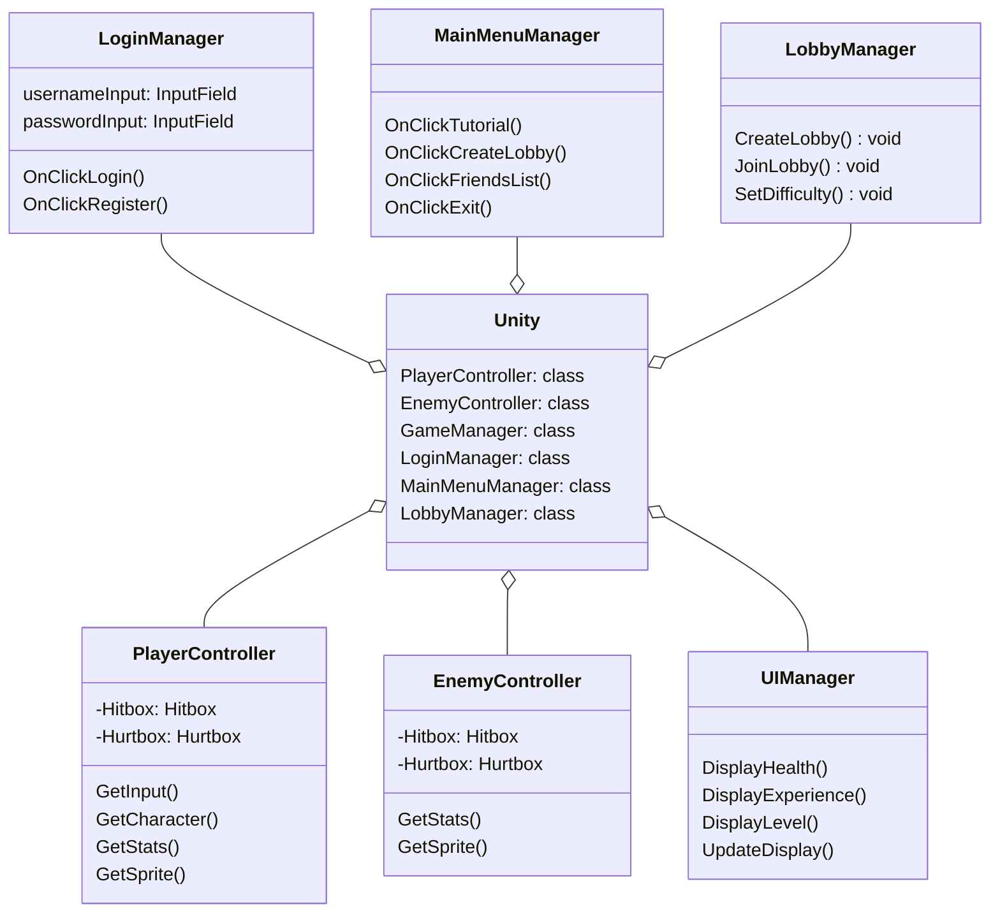
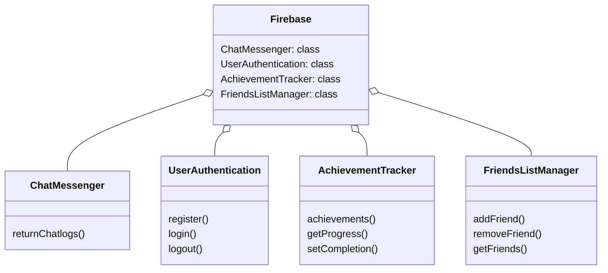
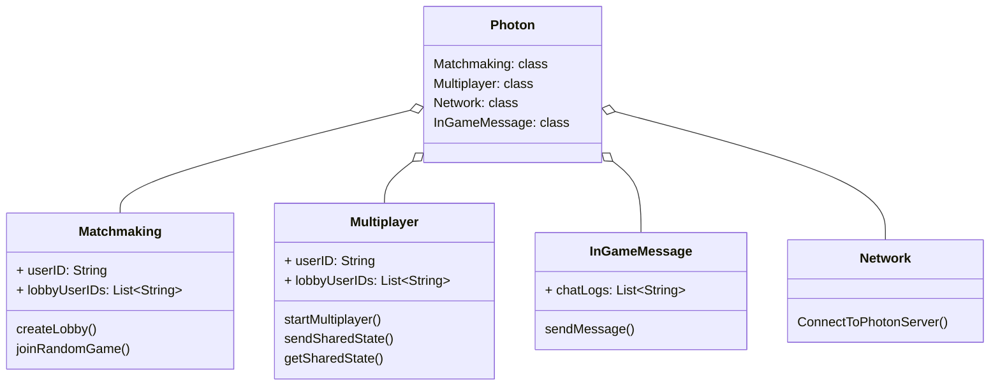

### Unity (Game Engine)
Unity will provide the main functionalities of the game. The Unity Editor allows us to import sprites, create scenes, animations, and attach scripts (some predefined). These scripts will be added to our in-game components within Unity and allow us to create physics for our sprites, react to player input, and generate our map procedurally. 
#### Interfaces (Data Sent)
* **Firebase Real-time Database**
    * Lobby Messages
    * New Friends' IDs
    * Credentials (Authentication)
* **Photon (Multiplayer)**
    * In-game messages
    * Current game state

### Firebase (Real-time Database & User Authentication)
Firebase will be used to create a customizable user authentication system, as well as a real-time database for friends' lists/user messages, and game invites. Firebase (Blaze Plan) can also react to in game events, to provide features like achievements, if we would like to upgrade our service. Firebase will interface with Unity to provide these functionalities.
#### Interfaces (Data Sent)
* **Unity**
    * Authentication Approval/Denial
    * Restore Previous Chat Messages
    * Retrieve Friends' List

### Photon (Networking Solution)
Photon is a real-time cloud Networking solution that is used for room-based multiplayer. It can be used to create a lobby for players to invite friends, randomly search for a game, or search through a parameterized list. It also provides in game chat through text/voice to provide a more social experience to the game. As UDP is the preferred connection protocol for multiplayer games we will most likely use this. Suggested port nubmers for UDP Client connections to the Game Server are 5056 or 27002 from Photon's documentation.
#### Interfaces (Data Sent)
* **Unity**
    * Other Users' game state
    * Messages From Other Users

#### To see a visual depiction of each component and their interfaces please see our System Block Diagram [here](https://capstone-projects-2024-spring.github.io/project-rpg-elements-game/docs/requirements/system-block-diagram).
