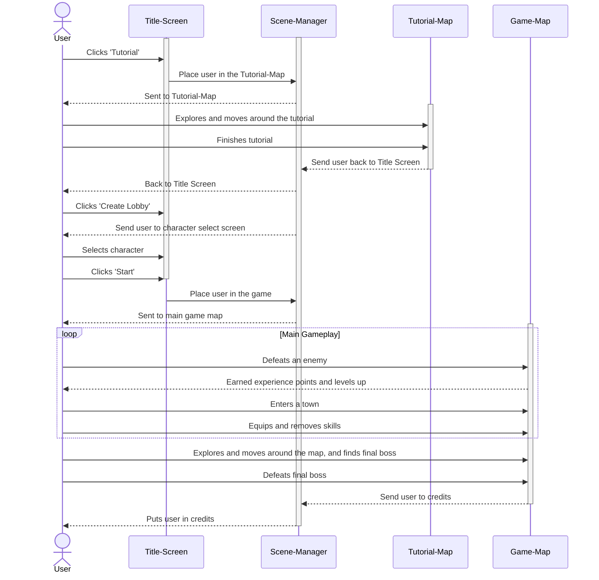
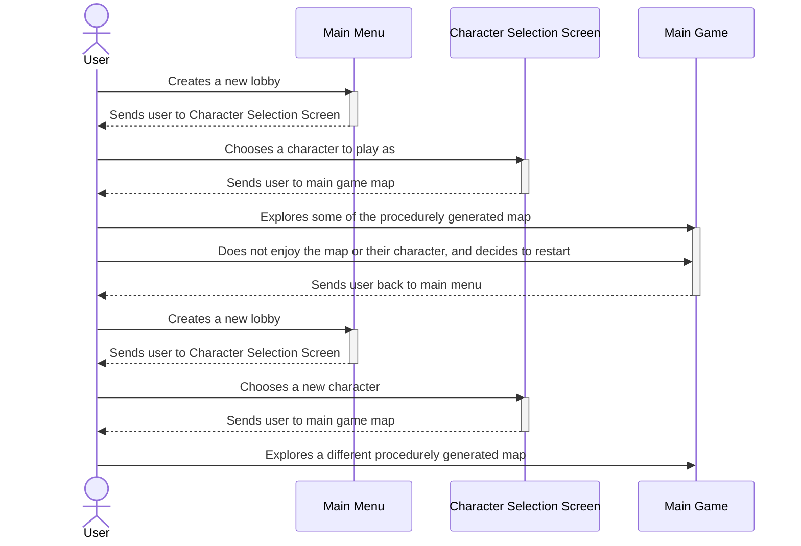
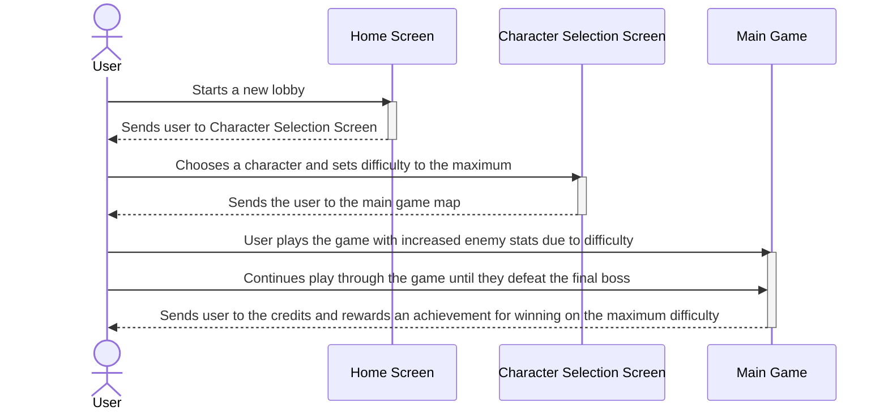
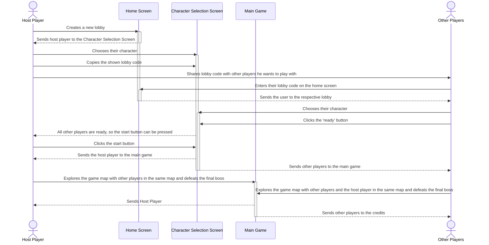

## State Diagram for Game Movement

*This state diagram details how the player can move and navigate the main game map. 
When idle, they have the choice of running, attacking, or jumping. 
While jumping, then can choose to attack while in the air, but they can not attack and then jump while they are still attacking. 
Running is the main method of travelling the map for the user, helping them move and explore more of the game map.*

## Use Case 1: Single-Player Game

#### Single-Player Game: A new user wants to play through the game. 

1. The user opens the game and is treated by the home screen. 
2. The home screen has a “tutorial”, “create lobby”, and “join lobby” buttons. Since this is the user’s first time playing the game, the user chooses “tutorial”.
3. The game teaches the user about all of the main mechanics and how to play.
4. After clearing the tutorial, the user is sent back to the title screen and clicks “create lobby”.
5. The user selects their character. Since this is a single-player game, there is no need for them to share the lobby code, so they just select start.
7. The user traverses through the various environments, enemies, and bosses.
8. As the user runs through the map, they have gained experience and new move sets.
9. The user returns to a town, where they are able to equip or remove skills.
11. The user eventually sets back out on their adventure and finds the final boss and is strong enough to defeat it.
12. Once the final boss is defeated, the credits roll, and the game is cleared.

## Use Case 2: Procedurally Generated Map

#### Procedurally Generated Map: A user wants to play through a game and have a different experience. 

1. Once loaded into the map and picked their class and character set out in the world.
2. The user levels up and realizes they are not enjoying their class and finds the map seed confusing.
3. The user exits to the main menu and creates a new lobby.
4. They then go through the process of starting a new game and choosing a new character.
5. Since the map was procedurally generated the map has completely changed and the user has a different experience. 

## Use Case 3: Changing difficulty

#### A user wants to challenge themselves and increase the difficulty scale. 

1. Users open the game and are greeted by the home screen.  
2. After opening the game, the host creates a lobby but does not invite any players. 
3. The user wanting to challenge themselves, increases the difficulty scale to the maximum. 
4. The user selects their class. 
5. The user starts the game and the map as well as elements load in. 
6. Compared to this player’s previous runs, they find it more challenging due to there being more enemies, the enemies having more damage, and because the enemies have more health. 
7. The player carefully traverses through the environment and defeats enemies until they are strong enough to defeat the final boss. 
8. Upon defeating the final boss, the credits roll, and the game is cleared. 
9. The player gains an achievement for defeating the game on maximum difficulty. 
## Use Case 4: Multiplayer

#### A user wants to play the game with multiple friends. 

1. Users open the game and are greeted by the home screen.  
2. After opening the game, the host chooses multiplayer and opens a lobby. 
3. Up to three other users can join the lobby using the invite code. 
4. Each user chooses their class and character. 
5. The host clicks begin after all users are ready. 
6. Each user loads into the map and can go their separate ways and play through the game.
7. Once at least one user beats the final boss, a way to exit the game will appear.
8. After all users go to the exit, the game will end.
